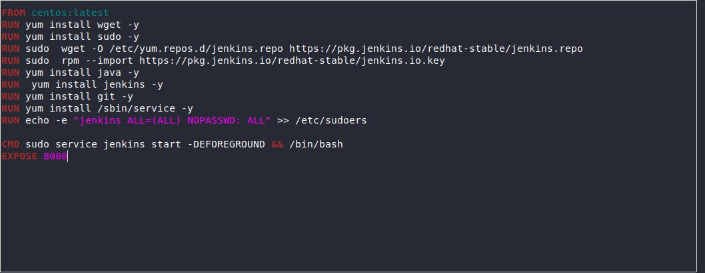

 ## I am creating  5 jobs in Jenkins as a task given in the MLOPS training under Mr. Vimal Daga of LinuxWorld Informatics Pvt.Ltd. 

### In the real world  product development  team is always worried about the downtime of the product. So we need human interfere.
### So, we need something which can automatically detect if something goes wrong and make it working . And here for automation I'm using Jenkins which will automatically set up server according to the code pushed on github and keeps monitoring the server> job1: pulls the code from github to our os


### job1: pulls the code from github to our os
### job2: checks for the type of code pulled and according starts a container for the code

### job3: It will check if our app is working or not or  sends email to the team if the app is crashed

### job4: if a container fails it restarts the container


### First we need of jenkins image for monitor our jobs . So here i use  Dockerfile to create jenkins image that we will use to create jenkins container.




```
docker build -t vishnu . 
```

