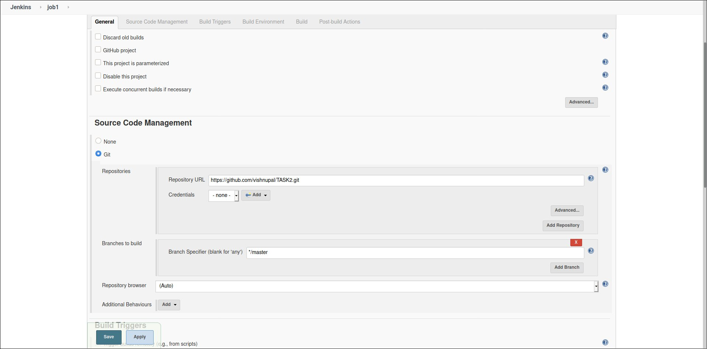
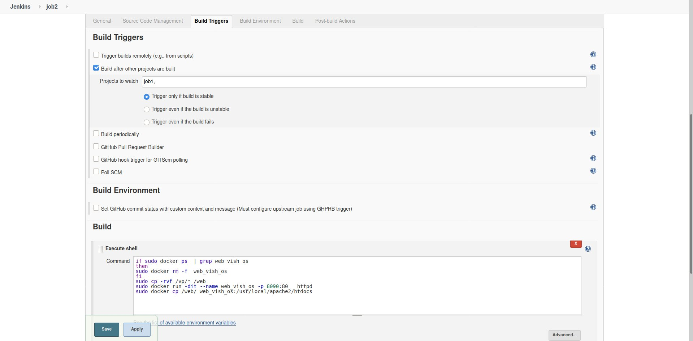
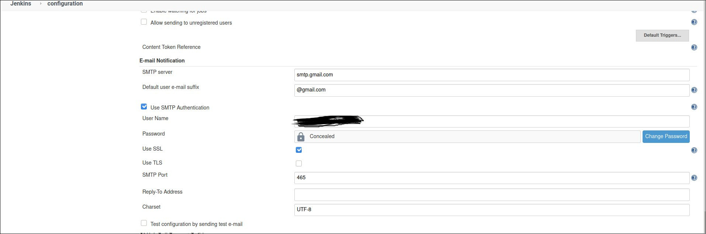

 ## I am creating  5 jobs in Jenkins as a task given in the MLOPS training under Mr. Vimal Daga of LinuxWorld Informatics Pvt.Ltd. 

### In the real world  product development  team is always worried about the downtime of the product. So we need human interfere.
### So, we need something which can automatically detect if something goes wrong and make it working . And here for automation I'm using Jenkins which will automatically set up server according to the code pushed on github and keeps monitoring the server> job1: pulls the code from github to our os


### job1: pulls the code from github to our os
### job2: checks for the type of code pulled and according starts a container for the code

### job3: It will check if our app is working or not or  sends email to the team if the app is crashed

### job4: if a container fails it restarts the container


### First we need of jenkins image for monitor our jobs . So here i use  Dockerfile to create jenkins image that we will use to create jenkins container.


 
### Save the above Dokckerfile withount any extension 

### Below command create a Jenkins docker image 
```
docker build -t Image_name . 
```
### For launch the Jenkins container :
```
docker run -it --name container_name -p 8081:8080 -v /var/run/docker.sock:/var/run/docker.sock  Image_name
```
#### For running docker inside jenkins container i mount the host system /var/run/docker.sock directory with container system /var/run/docker.sock directory 

### For creating a docker-ce repo run below command
```
curl -sSl https://get.docker.com |sh
```
### For installing the docker-ce run below command
```
yum install docker-ce --nobest
```

### job one Trigger when developer push the content of webserver



### Copy all github data in the vp folder


### Job2 trigger after job1 successfully run and it check if web_vish_os are running our not if running then remove and copy the vp directory content to web directory for secure main content of vp and create a new container name of container is same 



### Job3 trigger Job2 success . For checking the web server we use curl and check the web code if web code 200 or not.


### And in the case systen is fail then automatic send email  notification to our Email so we configure the SMTP (email notification) setting  . in case we not run then goto our gmail setting true the less secure app 




### And run the job4 in fail state 


### for visual we us build pipeline plugin

